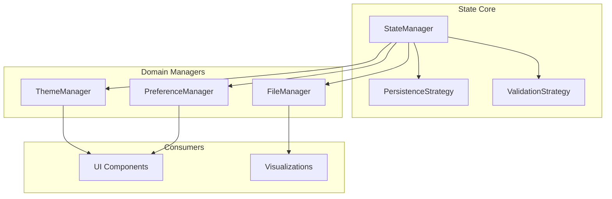

# State Management Deep Dive

Advanced patterns and implementation details of the state management system.

## Architecture



## StateManager Implementation

### Core Pattern

```javascript
class StateManager {
    #state = new Map();
    #subscribers = new Map();
    #persistence = null;

    constructor() {
        this.#loadInitialState();
    }

    set(key, value) {
        const oldValue = this.#state.get(key);

        // Validate if validator exists
        if (this.#validators.has(key)) {
            const valid = this.#validators.get(key)(value);
            if (!valid) throw new Error(`Invalid value for ${key}`);
        }

        // Update state
        this.#state.set(key, value);

        // Notify subscribers
        this.#notify(key, value, oldValue);

        // Persist if configured
        if (this.#shouldPersist(key)) {
            this.#persist(key, value);
        }
    }

    get(key) {
        return this.#state.get(key);
    }

    subscribe(key, callback) {
        if (!this.#subscribers.has(key)) {
            this.#subscribers.set(key, new Set());
        }
        this.#subscribers.get(key).add(callback);

        // Return unsubscribe function
        return () => {
            this.#subscribers.get(key).delete(callback);
        };
    }

    #notify(key, newValue, oldValue) {
        const subscribers = this.#subscribers.get(key);
        if (subscribers) {
            subscribers.forEach(callback => {
                callback(newValue, oldValue);
            });
        }
    }
}
```

### Singleton Pattern

```javascript
// Ensure single instance
let instance = null;

export function getStateManager() {
    if (!instance) {
        instance = new StateManager();
    }
    return instance;
}

// Export for convenience
export const stateManager = getStateManager();
```

## Persistence Strategies

### LocalStorage Strategy

```javascript
class LocalStoragePersistence {
    constructor(prefix = 'fitfileviewer_') {
        this.prefix = prefix;
    }

    save(key, value) {
        const storageKey = this.prefix + key;
        const serialized = JSON.stringify(value);
        localStorage.setItem(storageKey, serialized);
    }

    load(key) {
        const storageKey = this.prefix + key;
        const serialized = localStorage.getItem(storageKey);
        return serialized ? JSON.parse(serialized) : undefined;
    }

    remove(key) {
        const storageKey = this.prefix + key;
        localStorage.removeItem(storageKey);
    }
}
```

### Electron Store Strategy

```javascript
class ElectronStorePersistence {
    constructor(store) {
        this.store = store;
    }

    save(key, value) {
        this.store.set(key, value);
    }

    load(key) {
        return this.store.get(key);
    }

    remove(key) {
        this.store.delete(key);
    }
}
```

## Domain Managers

### ThemeManager

```javascript
class ThemeManager {
    constructor(stateManager) {
        this.stateManager = stateManager;
        this.#initialize();
    }

    #initialize() {
        // Load system preference
        const prefersDark = window.matchMedia('(prefers-color-scheme: dark)').matches;
        const savedTheme = this.stateManager.get('theme');

        this.setTheme(savedTheme || (prefersDark ? 'dark' : 'light'));

        // Listen for system changes
        window.matchMedia('(prefers-color-scheme: dark)')
            .addEventListener('change', (e) => {
                if (!this.stateManager.get('theme')) {
                    this.setTheme(e.matches ? 'dark' : 'light');
                }
            });
    }

    getTheme() {
        return this.stateManager.get('theme');
    }

    setTheme(theme) {
        this.stateManager.set('theme', theme);
        document.documentElement.dataset.theme = theme;
    }

    toggleTheme() {
        const current = this.getTheme();
        this.setTheme(current === 'dark' ? 'light' : 'dark');
    }
}
```

## Subscription Patterns

### Component Integration

```javascript
// In a UI component
class MapComponent {
    constructor() {
        this.unsubscribers = [];
    }

    mount() {
        // Subscribe to file changes
        const unsub = stateManager.subscribe('currentFile', (file) => {
            if (file) {
                this.renderRoute(file.data.gpsPoints);
            }
        });
        this.unsubscribers.push(unsub);

        // Subscribe to theme changes
        const themeUnsub = stateManager.subscribe('theme', (theme) => {
            this.updateMapTheme(theme);
        });
        this.unsubscribers.push(themeUnsub);
    }

    unmount() {
        // Clean up all subscriptions
        this.unsubscribers.forEach(unsub => unsub());
        this.unsubscribers = [];
    }
}
```

### Computed State

```javascript
// Derive state from other state
class ComputedState {
    constructor(dependencies, compute) {
        this.dependencies = dependencies;
        this.compute = compute;
        this.value = null;

        this.#setup();
    }

    #setup() {
        // Subscribe to all dependencies
        this.dependencies.forEach(key => {
            stateManager.subscribe(key, () => {
                this.#recompute();
            });
        });

        // Initial computation
        this.#recompute();
    }

    #recompute() {
        const values = this.dependencies.map(key =>
            stateManager.get(key)
        );
        this.value = this.compute(...values);
    }

    get() {
        return this.value;
    }
}

// Usage
const formattedDistance = new ComputedState(
    ['currentFile', 'preferences'],
    (file, prefs) => {
        if (!file) return null;
        return formatDistance(file.totalDistance, prefs.units);
    }
);
```

---

**Related:** [State Management API](/docs/api-reference/state-management)
