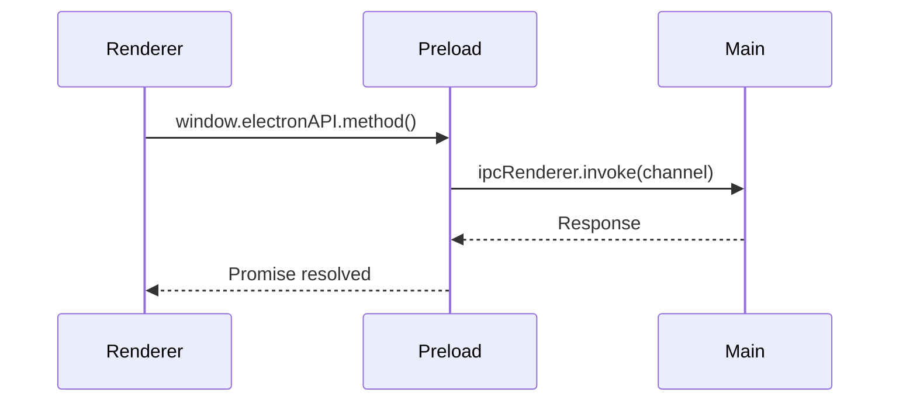

# IPC Communication

Reference for Electron IPC communication patterns.

## Overview

FitFileViewer uses Electron's IPC for secure main-renderer communication.



## Available Channels

### File Operations

#### `dialog:open-fit-file`

Opens file selection dialog.

```javascript
// Renderer
const result = await window.electronAPI.openFile();

// Main handler
ipcMain.handle('dialog:open-fit-file', async () => {
    return dialog.showOpenDialog({
        properties: ['openFile'],
        filters: [{ name: 'FIT Files', extensions: ['fit'] }]
    });
});
```

#### `file:read`

Reads file contents.

```javascript
// Renderer
const buffer = await window.electronAPI.readFile(filePath);

// Main handler
ipcMain.handle('file:read', async (event, filePath) => {
    return fs.promises.readFile(filePath);
});
```

### App Information

#### `app:get-version`

Gets application version.

```javascript
// Renderer
const version = await window.electronAPI.getVersion();

// Main handler
ipcMain.handle('app:get-version', () => {
    return app.getVersion();
});
```

## Preload Script

### Exposed API

```javascript
// preload.js
const { contextBridge, ipcRenderer } = require('electron');

contextBridge.exposeInMainWorld('electronAPI', {
    // File operations
    openFile: () => ipcRenderer.invoke('dialog:open-fit-file'),
    readFile: (path) => ipcRenderer.invoke('file:read', path),

    // App info
    getVersion: () => ipcRenderer.invoke('app:get-version'),

    // Events
    onFileOpened: (callback) => {
        ipcRenderer.on('file:opened', (event, data) => callback(data));
    }
});
```

## Event Communication

### Main → Renderer

```javascript
// Main process
mainWindow.webContents.send('file:opened', {
    path: filePath,
    data: fileData
});

// Renderer (via preload)
window.electronAPI.onFileOpened((data) => {
    console.log('File opened:', data.path);
});
```

### Renderer → Main

```javascript
// Renderer
const result = await window.electronAPI.openFile();

// Main
ipcMain.handle('dialog:open-fit-file', async (event) => {
    // Handle request
    return result;
});
```

## Security Considerations

### Input Validation

```javascript
// Always validate in main process
ipcMain.handle('file:read', async (event, filePath) => {
    // Validate path
    if (typeof filePath !== 'string') {
        throw new Error('Invalid path type');
    }

    // Validate extension
    if (!filePath.endsWith('.fit')) {
        throw new Error('Invalid file type');
    }

    // Validate path traversal
    const normalized = path.normalize(filePath);
    if (normalized.includes('..')) {
        throw new Error('Path traversal detected');
    }

    return fs.promises.readFile(normalized);
});
```

### Limited Exposure

Only expose necessary functions:

```javascript
// ❌ Bad: Exposes too much
ipcRenderer: ipcRenderer,  // Full access

// ✅ Good: Specific functions only
openFile: () => ipcRenderer.invoke('dialog:open-fit-file'),
```

---

**Next:** [State Management →](/docs/api-reference/state-management)
