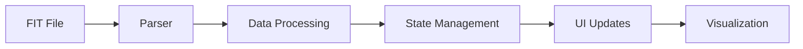
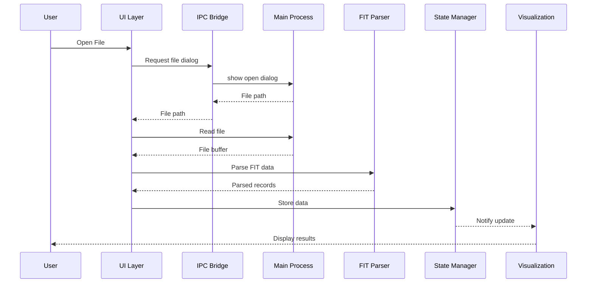
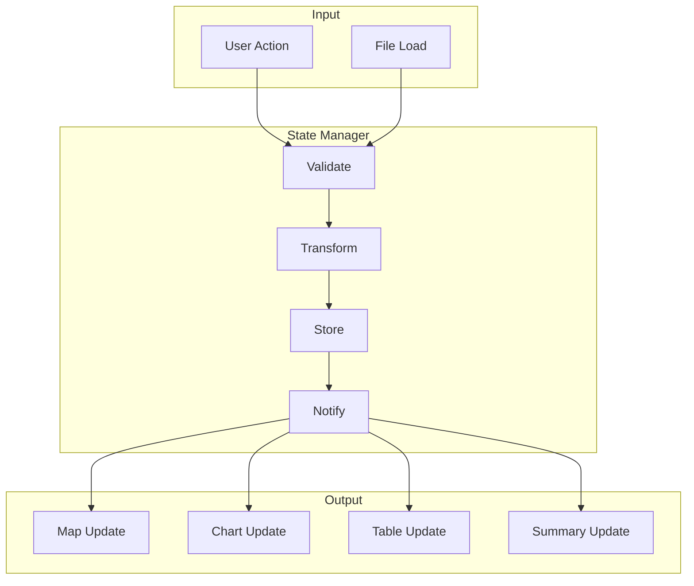

# Data Flow

Understanding how data moves through FitFileViewer from file input to visualization.

## Overview



## File Loading Flow



## Data Processing Stages

### 1. File Input

User provides FIT file via:
- Drag and drop
- File dialog
- Recent files

### 2. File Reading

```javascript
// Main process reads file
const buffer = await fs.promises.readFile(filePath);
```

### 3. FIT Parsing

```javascript
// Garmin FIT SDK parses binary data
const decoder = new FitDecoder();
decoder.read(buffer);
const records = decoder.getRecords();
```

### 4. Data Extraction

Parsed data organized into:
- Records (GPS points, metrics)
- Laps (segment summaries)
- Sessions (activity summary)

### 5. Data Processing

```javascript
// Process and normalize data
const processedData = {
    records: normalizeRecords(rawRecords),
    laps: extractLaps(rawLaps),
    summary: calculateSummary(rawSession),
    gpsPoints: extractGpsTrack(rawRecords)
};
```

### 6. State Storage

```javascript
// Store in state manager
stateManager.set('currentFile', processedData);
stateManager.set('metadata', fileMetadata);
```

### 7. View Updates

Each visualization component subscribes to state:

```javascript
// Maps component
stateManager.subscribe('currentFile', (data) => {
    renderMapRoute(data.gpsPoints);
});

// Charts component
stateManager.subscribe('currentFile', (data) => {
    renderCharts(data.records);
});
```

## Data Structures

### Record Structure

```javascript
{
    timestamp: Date,
    position_lat: number,  // Degrees
    position_long: number, // Degrees
    distance: number,      // Meters
    speed: number,         // m/s
    heart_rate: number,    // BPM
    altitude: number,      // Meters
    cadence: number,       // RPM
    power: number          // Watts
}
```

### Lap Structure

```javascript
{
    start_time: Date,
    total_elapsed_time: number,
    total_distance: number,
    avg_speed: number,
    max_speed: number,
    avg_heart_rate: number,
    max_heart_rate: number,
    total_calories: number
}
```

### Session Structure

```javascript
{
    sport: string,
    start_time: Date,
    total_elapsed_time: number,
    total_distance: number,
    avg_speed: number,
    max_speed: number,
    total_ascent: number,
    total_descent: number,
    total_calories: number
}
```

## State Management Flow



## Error Handling

### At Each Stage

```javascript
try {
    const buffer = await readFile(path);
    const records = await parseFile(buffer);
    const processed = processData(records);
    updateState(processed);
} catch (error) {
    handleError(error, 'file-processing');
    showUserError('Failed to load file');
}
```

---

**Next:** [Security Model →](/docs/architecture/security)
