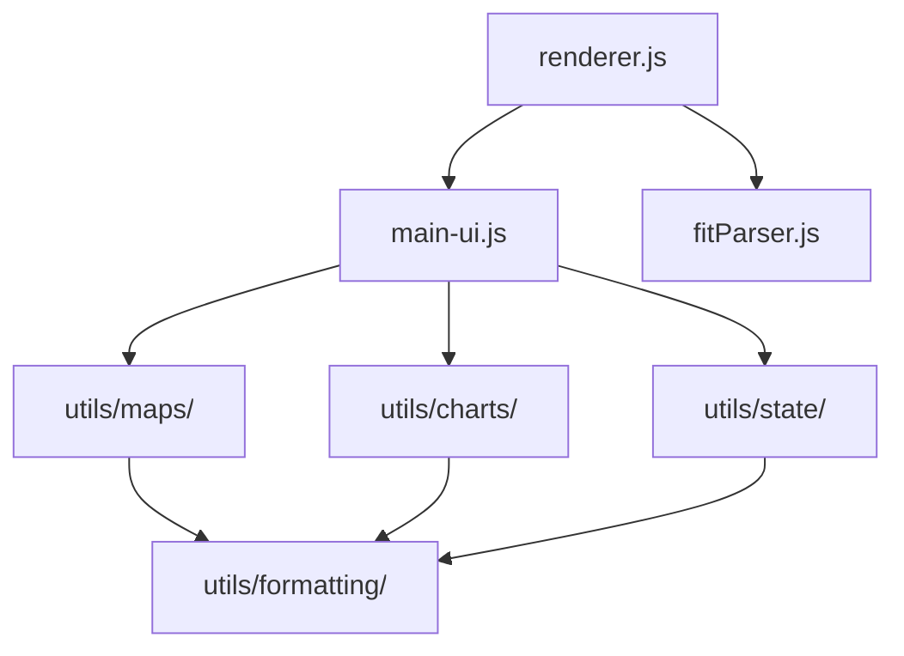

# Module System

FitFileViewer uses a modular architecture with 50+ utility modules organized by functionality.

## Module Organization

```
utils/
├── formatting/        # Data formatting
│   ├── formatDistance.js
│   ├── formatDuration.js
│   ├── formatSpeed.js
│   └── ...
├── maps/             # Map functionality
│   ├── renderMap.js
│   ├── mapBaseLayers.js
│   ├── mapDrawLaps.js
│   └── ...
├── charts/           # Chart functionality
│   ├── chartSpec.js
│   ├── renderChartJS.js
│   └── ...
├── state/            # State management
│   ├── core/
│   └── managers/
├── files/            # File operations
│   ├── handleOpenFile.js
│   ├── recentFiles.js
│   └── ...
├── ui/               # UI components
│   ├── tabManager.js
│   ├── fullscreen.js
│   └── ...
└── ...               # More modules
```

## Module Categories

### Formatting Modules

Handle data display formatting:

| Module | Purpose |
|--------|---------|
| `formatDistance.js` | Distance values |
| `formatDuration.js` | Time durations |
| `formatSpeed.js` | Speed/pace |
| `formatUtils.js` | General utilities |

### Map Modules

Geographic visualization:

| Module | Purpose |
|--------|---------|
| `renderMap.js` | Main map rendering |
| `mapBaseLayers.js` | Tile layer providers |
| `mapDrawLaps.js` | Lap marker drawing |
| `mapFullscreenControl.js` | Fullscreen mode |
| `mapMeasureTool.js` | Distance measurement |

### Chart Modules

Data visualization:

| Module | Purpose |
|--------|---------|
| `chartSpec.js` | Chart configuration |
| `renderChartJS.js` | Chart.js rendering |
| `vegaLiteUtils.js` | Vega-Lite charts |

### State Modules

Application state:

| Module | Purpose |
|--------|---------|
| `stateManager.js` | Central state |
| `themeManager.js` | Theme state |
| `fileStateManager.js` | File state |

### UI Modules

User interface:

| Module | Purpose |
|--------|---------|
| `tabManager.js` | Tab navigation |
| `fullscreen.js` | Fullscreen handling |
| `setupWindow.js` | Window setup |

## Import Patterns

### Direct Import

```javascript
import { formatDistance } from './utils/formatting/formatDistance.js';
```

### Barrel Export

```javascript
// utils/formatting/index.js
export { formatDistance } from './formatDistance.js';
export { formatDuration } from './formatDuration.js';

// Usage
import { formatDistance, formatDuration } from './utils/formatting/index.js';
```

### Dynamic Import

```javascript
// Lazy loading for performance
const { renderMap } = await import('./utils/maps/renderMap.js');
```

## Module Standards

### Single Responsibility

Each module has one clear purpose:

```javascript
// Good: Single responsibility
// formatDistance.js
export function formatDistance(meters, unit = 'km') {
    // Only handles distance formatting
}

// Bad: Multiple responsibilities
// formatters.js
export function formatDistance() { }
export function formatDuration() { }
export function renderChart() { }  // Unrelated
```

### Clear Exports

```javascript
// Named exports preferred
export function formatDistance(meters) { }
export function convertToMiles(meters) { }

// Default export for main functionality
export default function formatDistance(meters) { }
```

### Documentation

```javascript
/**
 * Formats a distance value for display.
 *
 * @param {number} meters - Distance in meters
 * @param {string} unit - Target unit ('km' or 'mi')
 * @returns {string} Formatted distance string
 *
 * @example
 * formatDistance(5000); // "5.00 km"
 * formatDistance(5000, 'mi'); // "3.11 mi"
 */
export function formatDistance(meters, unit = 'km') {
    // Implementation
}
```

## Module Dependencies

### Dependency Graph



### Dependency Rules

1. **No circular dependencies**
2. **Lower modules don't import higher**
3. **Formatting is a base layer**

---

**Next:** [Data Flow →](/docs/architecture/data-flow)
