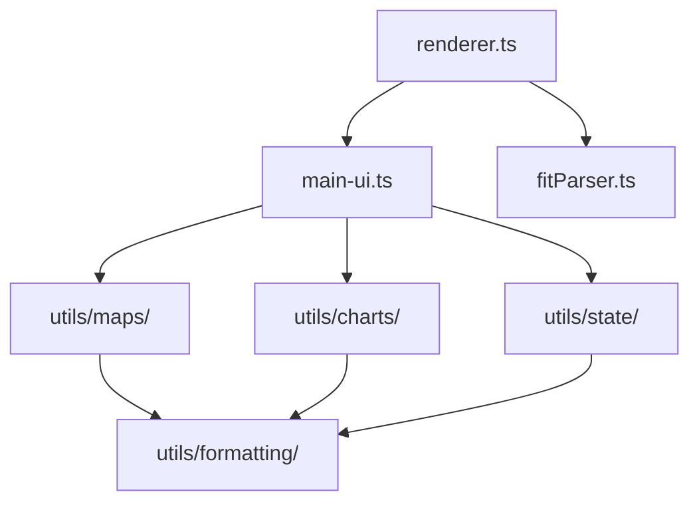

# Module System

FitFileViewer uses root-owned build, lint, and test tooling with Electron source
under `electron-app/`. Runtime modules are TypeScript-first and are compiled by
root scripts into `dist/`.

## Module Organization

```text
electron-app/utils/
├── app/          # Application lifecycle, menu, initialization, and performance helpers
├── async/        # Small async compatibility helpers
├── charts/       # Chart components, core rendering, plugins, and theming
├── config/       # Shared constants and configuration exports
├── data/         # Lookups, processors, derived metrics, and zone helpers
├── debug/        # Debug overlays, state devtools, and diagnostics
├── docs/         # Runtime documentation metadata helpers
├── dom/          # DOM escaping and sanitization helpers
├── errors/       # Error normalization and reporting helpers
├── files/        # FIT import, export, recent-file, and file browser workflows
├── formatting/   # Unit conversion and display formatters
├── legacy/       # Temporary compatibility globals while old renderer code is retired
├── logging/      # Renderer/main logging utilities
├── maps/         # Leaflet controls, filters, layers, and map rendering
├── net/          # Network and remote-resource helpers
├── performance/  # Runtime performance helpers
├── rendering/    # Summary, table, and shared render helpers
├── runtime/      # Runtime environment guards such as process env access
├── state/        # State core, domain managers, and main-process integration
├── storage/      # Storage abstractions
├── theming/      # Theme core and map-specific theme integration
├── types/        # Shared lightweight runtime types
└── ui/           # Controls, modals, notifications, tabs, browser tab, and layout helpers
```

Use `rg --files electron-app/utils` for exact module names. Do not document
generated JavaScript output as source files.

## Module Categories

### Formatting

Formatting utilities live under `electron-app/utils/formatting/`:

| Area         | Example source file                                                | Purpose                         |
| ------------ | ------------------------------------------------------------------ | ------------------------------- |
| Converters   | `electron-app/utils/formatting/converters/convertDistanceUnits.ts` | Unit conversion                 |
| Display      | `electron-app/utils/formatting/display/formatTooltipData.ts`       | Chart and table display helpers |
| Formatters   | `electron-app/utils/formatting/formatters/formatDistance.ts`       | User-facing value formatting    |
| Domain index | `electron-app/utils/formatting/index.ts`                           | Public formatting exports       |

### Maps

Map modules are grouped by role:

| Area     | Example source file                                     | Purpose                    |
| -------- | ------------------------------------------------------- | -------------------------- |
| Core     | `electron-app/utils/maps/core/renderMap.ts`             | Main map rendering         |
| Controls | `electron-app/utils/maps/controls/mapMeasureTool.ts`    | User-facing map controls   |
| Layers   | `electron-app/utils/maps/layers/mapBaseLayers.ts`       | Tile layers and route draw |
| Filters  | `electron-app/utils/maps/filters/mapMetricFilter.ts`    | Route metric filtering     |

### Charts

Chart modules are split between orchestration, rendering, plugins, DOM helpers,
and theme integration:

| Area       | Example source file                                               | Purpose                        |
| ---------- | ----------------------------------------------------------------- | ------------------------------ |
| Core       | `electron-app/utils/charts/core/renderChartJS.ts`                 | Chart rendering orchestration  |
| Rendering  | `electron-app/utils/charts/rendering/renderGPSTrackChart.ts`      | Specific chart renderers       |
| Plugins    | `electron-app/utils/charts/plugins/chartZoomResetPlugin.ts`       | Chart.js plugin integration    |
| Components | `electron-app/utils/charts/components/createEnhancedChart.ts`     | Chart DOM/component helpers    |
| Theming    | `electron-app/utils/charts/theming/chartThemeUtils.ts`            | Chart theme and color handling |

### State

State modules are organized by responsibility:

| Area        | Example source file                                                | Purpose                         |
| ----------- | ------------------------------------------------------------------ | ------------------------------- |
| Core        | `electron-app/utils/state/core/stateManager.ts`                    | Observable state store          |
| Domain      | `electron-app/utils/state/domain/fitFileState.ts`                  | Domain-specific state workflows |
| Integration | `electron-app/utils/state/integration/mainProcessStateClient.ts`   | Renderer/main state bridge      |
| Index       | `electron-app/utils/state/index.ts`                                | Public state exports            |

### UI

UI utilities are grouped by workflow:

| Area          | Example source file                                             | Purpose                        |
| ------------- | --------------------------------------------------------------- | ------------------------------ |
| Controls      | `electron-app/utils/ui/controls/enableTabButtons.ts`            | Interactive control setup      |
| Modals        | `electron-app/utils/ui/modals/ensureAboutModal.ts`              | Modal creation and behavior    |
| Notifications | `electron-app/utils/ui/notifications/showNotification.ts`       | User notifications             |
| Tabs          | `electron-app/utils/ui/tabs/tabStateManager.ts`                 | Tab coordination               |
| Browser       | `electron-app/utils/ui/browser/initFitBrowserFeatureGate.ts`    | FIT browser feature gating     |

## Import Patterns

### Direct Import

TypeScript source imports use runtime `.js` specifiers so the emitted modules
resolve correctly:

```typescript
import { formatDistance } from "./utils/formatting/formatters/formatDistance.js";
```

### Barrel Export

```typescript
// electron-app/utils/formatting/formatters/index.ts
export { formatDistance } from "./formatDistance.js";
export { formatDuration } from "./formatDuration.js";

// Usage from a nearby source file
import { formatDistance, formatDuration } from "./utils/formatting/index.js";
```

### Dynamic Import

```typescript
const { renderMap } = await import("./utils/maps/core/renderMap.js");
```

## Module Standards

### Single Responsibility

Keep modules focused on one domain concern:

```typescript
export function formatDistance(meters: number): string {
    // Only handles distance formatting
}
```

Avoid mixing unrelated behavior in a single module:

```typescript
export function formatDistance(): string {
    return "";
}

export function renderChart(): void {
    // Chart rendering belongs in the chart domain, not formatting.
}
```

### Clear Exports

```typescript
export function formatDistance(meters: number): string {
    return `${meters} m`;
}

export function convertToMiles(meters: number): number {
    return meters / 1609.344;
}
```

### Documentation

```typescript
/**
 * Formats a distance value for display.
 *
 * @example
 * formatDistance(5000);
 *
 * @param meters - Distance in meters
 * @returns Formatted distance string
 */
export function formatDistance(meters: number): string {
    return `${(meters / 1000).toFixed(2)} km`;
}
```

## Module Dependencies


```mermaid
flowchart TD
    A[renderer.ts] --> B[main-ui.ts]
    A --> C[fitParser.ts]

    B --> D[utils/maps/]
    B --> E[utils/charts/]
    B --> F[utils/state/]

    D --> G[utils/formatting/]
    E --> G
    F --> G
```

### Dependency Rules

1. Keep generated output under root `dist/`; source stays under `electron-app/`.
2. Prefer domain indexes for shared exports.
3. Avoid circular dependencies between utility domains.
4. Keep low-level helpers independent from UI and renderer orchestration.

---

**Next:** [Data Flow →](/docs/architecture/data-flow)
