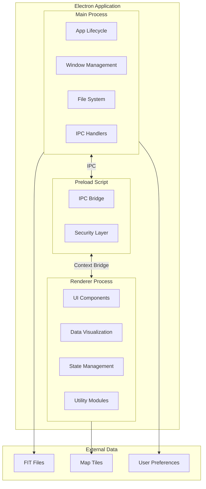
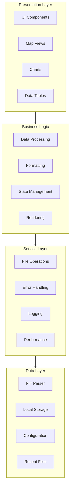
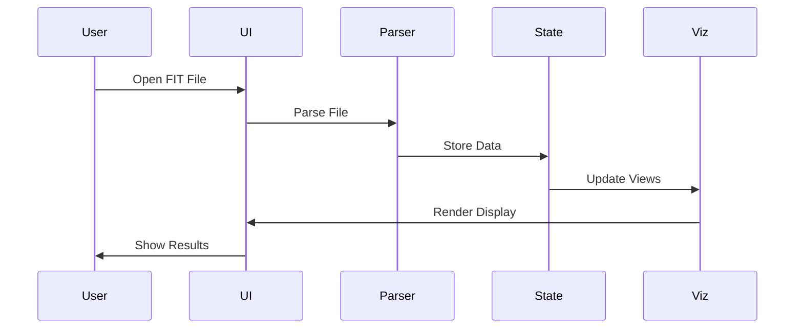

# Architecture Overview

FitFileViewer is built as a cross-platform desktop application using Electron with a modular, scalable architecture.

## High-Level Architecture



## Key Principles

### 🔐 Security-First

- Context isolation enabled
- Node integration disabled in renderer
- Secure IPC communication
- Input validation

### 📦 Modularity

- 50+ utility modules
- Clear separation of concerns
- Reusable components
- Single responsibility

### ⚡ Performance

- Lazy loading
- Efficient data processing
- Memory management
- Caching strategies

## Technology Stack

| Layer | Technology | Purpose |
|-------|-----------|---------|
| Framework | Electron | Cross-platform desktop |
| UI | HTML/CSS/JS | User interface |
| Charts | Chart.js, Vega-Lite | Data visualization |
| Maps | Leaflet | Geographic display |
| Tables | DataTables | Data grid |
| Parser | Garmin FIT SDK | FIT file parsing |

## Component Layers



## Process Model

FitFileViewer uses Electron's multi-process architecture:

| Process | Responsibilities |
|---------|-----------------|
| **Main** | App lifecycle, window management, file system, IPC |
| **Renderer** | UI rendering, user interaction, visualization |
| **Preload** | Secure bridge between main and renderer |

## Module Organization

```
electron-app/
├── main.js           # Main process entry
├── renderer.js       # Renderer process entry
├── preload.js        # Security bridge
├── main-ui.js        # UI management
├── fitParser.js      # FIT file parsing
└── utils/            # Utility modules
    ├── formatting/   # Data formatters
    ├── maps/         # Map utilities
    ├── charts/       # Chart utilities
    ├── state/        # State management
    └── ...           # More modules
```

## Data Flow



## Security Model

### IPC Security

All communication between processes uses validated channels:

```javascript
// Preload - Exposed API
contextBridge.exposeInMainWorld('electronAPI', {
    openFile: () => ipcRenderer.invoke('dialog:open-fit-file'),
    // Only specific, validated operations
});
```

### Content Security

- No remote content loading
- Strict CSP headers
- Sandboxed renderer

---

**Next:** [Process Architecture →](/docs/architecture/process-model)
