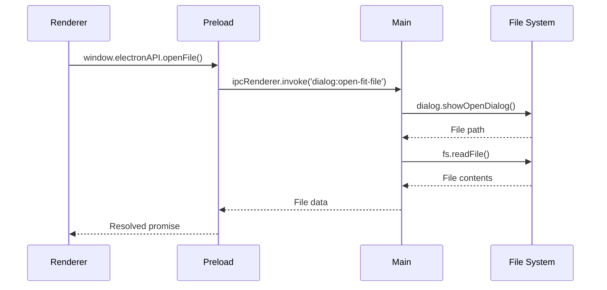

# Process Architecture

FitFileViewer uses Electron's multi-process architecture for security and performance.

## Process Overview

```mermaid
flowchart LR
    subgraph Main["Main Process"]
        direction TB
        A1[App Lifecycle]
        A2[BrowserWindow]
        A3[File System]
        A4[Menu System]
        A5[Auto-Updater]
    end

    subgraph Preload["Preload Script"]
        direction TB
        B1[Context Bridge]
        B2[IPC Bridge]
        B3[Security]
    end

    subgraph Renderer["Renderer Process"]
        direction TB
        C1[UI Rendering]
        C2[User Interaction]
        C3[Visualization]
        C4[State Management]
    end

    Main <--> Preload
    Preload <--> Renderer
```



## Main Process

The main process (`main.js`) handles:

### App Lifecycle

```javascript
app.whenReady().then(() => {
    createWindow();
    setupMenu();
    setupIpcHandlers();
});

app.on('window-all-closed', () => {
    if (process.platform !== 'darwin') {
        app.quit();
    }
});
```

### Window Management

- Creating browser windows
- Window state persistence
- Multi-window support

### File System Access

- File dialogs (open/save)
- File reading
- Recent files management

### IPC Handlers

```javascript
ipcMain.handle('dialog:open-fit-file', async () => {
    const result = await dialog.showOpenDialog({
        filters: [{ name: 'FIT Files', extensions: ['fit'] }]
    });
    return result;
});
```

## Preload Script

The preload script (`preload.js`) bridges main and renderer:

### Context Bridge

```javascript
contextBridge.exposeInMainWorld('electronAPI', {
    openFile: () => ipcRenderer.invoke('dialog:open-fit-file'),
    onFileOpened: (callback) => ipcRenderer.on('file:opened', callback),
    // Limited, validated operations only
});
```

### Security

- Validates all messages
- Sanitizes data
- Prevents prototype pollution

## Renderer Process

The renderer process handles the UI:

### Entry Point (`renderer.js`)

```javascript
// Initialize application
document.addEventListener('DOMContentLoaded', () => {
    initializeApp();
    setupEventListeners();
    loadTheme();
});
```

### UI Management (`main-ui.js`)

- Tab navigation
- User interactions
- View updates

### Module Loading

```javascript
// Dynamic imports for code splitting
const { renderMap } = await import('./utils/maps/renderMap.js');
const { renderChart } = await import('./utils/charts/renderChart.js');
```

## IPC Communication

### Main → Renderer

```javascript
// Main process
mainWindow.webContents.send('file:opened', fileData);

// Renderer (via preload)
window.electronAPI.onFileOpened((event, data) => {
    processFileData(data);
});
```

### Renderer → Main

```javascript
// Renderer
const result = await window.electronAPI.openFile();

// Main process
ipcMain.handle('dialog:open-fit-file', async () => {
    return dialog.showOpenDialog(options);
});
```

## Security Isolation

### Context Isolation

```javascript
// main.js - Window creation
const mainWindow = new BrowserWindow({
    webPreferences: {
        contextIsolation: true,
        nodeIntegration: false,
        sandbox: true,
        preload: path.join(__dirname, 'preload.js')
    }
});
```

### Why This Matters

| Setting | Value | Purpose |
|---------|-------|---------|
| contextIsolation | true | Separate JS contexts |
| nodeIntegration | false | No Node in renderer |
| sandbox | true | OS-level isolation |

## Process Communication Flow



---

**Next:** [Module System →](/docs/architecture/module-system)
