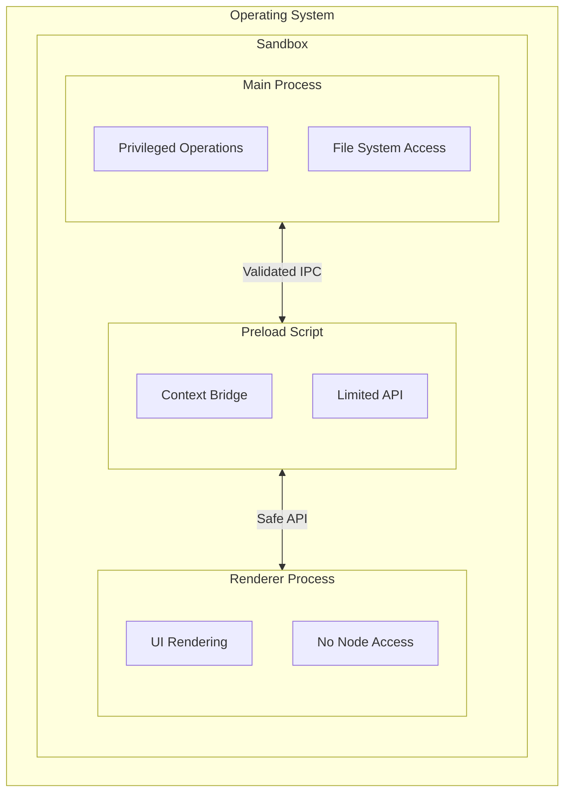

# Security Model

FitFileViewer implements multiple security layers following Electron security best practices.

## Security Overview



## Core Security Features

### Context Isolation

Renderer JavaScript runs in an isolated context:

```javascript
// main.js
const mainWindow = new BrowserWindow({
    webPreferences: {
        contextIsolation: true,    // Separate contexts
        nodeIntegration: false,    // No Node in renderer
        sandbox: true,             // OS sandbox
        preload: path.join(__dirname, 'preload.js')
    }
});
```

### Why Context Isolation?

| Without | With |
|---------|------|
| Renderer can access Node | Renderer isolated |
| Window object exposed | Window protected |
| Easy to exploit | Secure by default |

## IPC Security

### Validated Channels

Only specific, validated operations are exposed:

```javascript
// preload.js
const validChannels = [
    'dialog:open-fit-file',
    'file:read',
    'app:get-version'
];

contextBridge.exposeInMainWorld('electronAPI', {
    openFile: () => ipcRenderer.invoke('dialog:open-fit-file'),
    getVersion: () => ipcRenderer.invoke('app:get-version'),
    // No arbitrary channel access
});
```

### Input Validation

All inputs validated before processing:

```javascript
// main.js
ipcMain.handle('file:read', async (event, filePath) => {
    // Validate file path
    if (!isValidFilePath(filePath)) {
        throw new Error('Invalid file path');
    }

    // Validate file extension
    if (!filePath.endsWith('.fit')) {
        throw new Error('Invalid file type');
    }

    // Safe to proceed
    return fs.promises.readFile(filePath);
});
```

## File System Security

### Path Validation

```javascript
function isValidFilePath(filePath) {
    // Normalize path
    const normalized = path.normalize(filePath);

    // Prevent directory traversal
    if (normalized.includes('..')) {
        return false;
    }

    // Check file exists
    if (!fs.existsSync(normalized)) {
        return false;
    }

    return true;
}
```

### File Type Restrictions

Only FIT files are processed:

```javascript
const allowedExtensions = ['.fit'];

function validateFileType(filePath) {
    const ext = path.extname(filePath).toLowerCase();
    return allowedExtensions.includes(ext);
}
```

## Content Security Policy

### CSP Headers

```javascript
// Restrict content sources
const csp = [
    "default-src 'self'",
    "script-src 'self'",
    "style-src 'self' 'unsafe-inline'",
    "img-src 'self' data: https://*.tile.openstreetmap.org",
    "connect-src 'self' https://*.tile.openstreetmap.org"
].join('; ');
```

### What This Prevents

- ❌ Inline script injection
- ❌ External script loading
- ❌ Unauthorized network requests

## Navigation Security

### Prevent External Navigation

```javascript
// main.js
mainWindow.webContents.on('will-navigate', (event, url) => {
    // Only allow same-origin navigation
    if (!url.startsWith('file://')) {
        event.preventDefault();
    }
});

mainWindow.webContents.setWindowOpenHandler(() => {
    // Prevent new windows
    return { action: 'deny' };
});
```

## Data Privacy

### Local Data Only

FitFileViewer processes all data locally:

- ✅ FIT files stay on your computer
- ✅ No data uploaded to servers
- ✅ No telemetry or tracking
- ✅ Map tiles cached locally

### What's Stored

| Data | Location | Purpose |
|------|----------|---------|
| Recent files | User data dir | Quick access |
| Preferences | User data dir | Settings |
| Theme | Local storage | UI preference |

### What's NOT Stored

- ❌ FIT file contents
- ❌ GPS coordinates
- ❌ Personal information

## Security Best Practices

### For Users

1. **Download from official sources**
   - GitHub releases only
   - Verify file hashes

2. **Keep updated**
   - Security patches in updates
   - Enable auto-update

3. **Be cautious with files**
   - Only open trusted FIT files
   - Don't open files from unknown sources

### For Developers

1. **Never disable security features**
2. **Validate all inputs**
3. **Use allowlists, not blocklists**
4. **Keep dependencies updated**

## Reporting Security Issues

Found a vulnerability? Please report responsibly:

1. **Don't** open a public issue
2. **Do** email: `20943337+Nick2bad4u@users.noreply.github.com`
3. Include:
   - Description of vulnerability
   - Steps to reproduce
   - Potential impact

---

**Related:** [Architecture Overview](/docs/architecture/overview)
