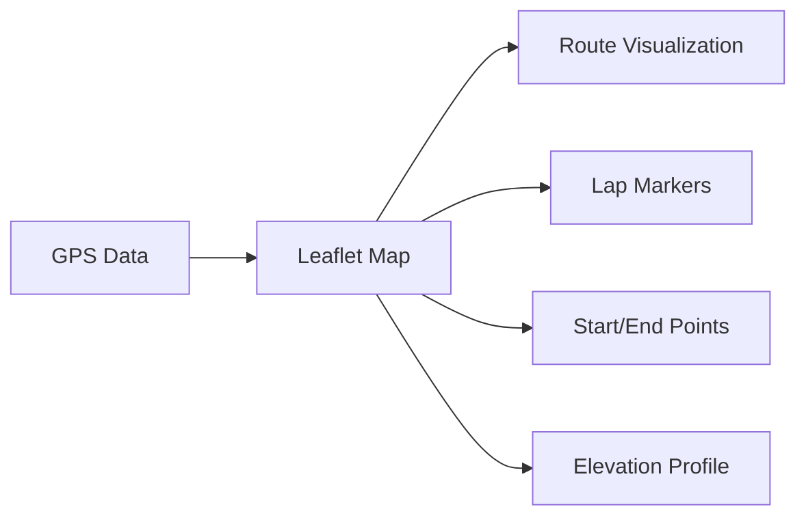

# FitFileViewer Documentation

Welcome to the comprehensive documentation for **FitFileViewer**, a cross-platform desktop application for viewing and analyzing `.fit` files from fitness devices like Garmin watches and cycling computers.

  <a href="https://github.com/Nick2bad4u/FitFileViewer/releases" className="button button--primary button--lg">
    📦 Download Latest
  </a>
  <a href="/docs/getting-started/installation" className="button button--secondary button--lg">
    🚀 Get Started
  </a>

## 🎯 What is FitFileViewer?

FitFileViewer is a free, open-source application that lets you:

- **View GPS Routes** on interactive maps with multiple tile providers
- **Analyze Performance** with detailed charts and graphs
- **Explore Data** through comprehensive data tables
- **Export Data** in various formats (CSV, GPX, images)
- **Work Offline** - all your data stays on your computer

## 📚 Documentation Overview

| Section | Description |
|---------|-------------|
| [🚀 Getting Started](/docs/category/getting-started) | Installation, system requirements, and quick start guide |
| [👤 User Guide](/docs/category/user-guide) | How to use the application effectively |
| [📊 Data Visualization](/docs/category/data-visualization) | Maps, charts, tables, and summary views |
| [🏗️ Architecture](/docs/category/architecture) | Technical architecture and design patterns |
| [🛠️ Development](/docs/category/development) | Development setup and contribution guidelines |
| [🔧 API Reference](/docs/category/api-reference) | API documentation for developers |

## 🚀 Quick Start

### 1. Download and Install

Get the latest release for your operating system:

- **Windows**: `.exe` installer or portable version
- **macOS**: `.dmg` or `.pkg` package
- **Linux**: `.AppImage`, `.deb`, `.rpm`, or other formats

👉 [Download Latest Release](https://github.com/Nick2bad4u/FitFileViewer/releases/latest)

### 2. Open a FIT File

1. Launch FitFileViewer
2. Drag and drop a `.fit` file into the window, or
3. Use **File → Open FIT File** (or press `Ctrl+O` / `Cmd+O`)

### 3. Explore Your Data

Navigate between tabs to view:

- **🗺️ Map**: Interactive GPS route visualization
- **📊 Charts**: Performance graphs and charts
- **📋 Tables**: Detailed data records
- **📄 Summary**: Activity statistics and metrics

## ✨ Key Features

### Interactive Maps 🗺️

- Multiple map styles (OpenStreetMap, Satellite, Terrain)
- Route visualization with lap markers
- Measurement tools for distance analysis
- Full-screen mode for detailed viewing

### Performance Charts 📊

View your data with interactive Chart.js and Vega-Lite charts:

- Speed vs Time/Distance
- Heart Rate zones and trends
- Elevation profiles
- Power and Cadence data
- Custom data ranges and zoom

### Data Tables 📋

- Sortable and filterable records
- Export to CSV format
- Search through thousands of data points
- Lap and session summaries

### Cross-Platform Support 💻

| Platform | Supported Formats |
|----------|------------------|
| Windows | `.exe`, `.msi`, `.portable` |
| macOS | `.dmg`, `.pkg`, `.zip` |
| Linux | `.AppImage`, `.deb`, `.rpm`, `.snap` |

## 🔧 Technical Details

FitFileViewer is built with modern technologies:

- **Electron** - Cross-platform desktop framework
- **Chart.js & Vega-Lite** - Data visualization
- **Leaflet** - Interactive maps
- **DataTables** - Data table management
- **Garmin FIT SDK** - FIT file parsing

## 📖 Documentation Sections

### For Users

- **[Installation Guide](/docs/getting-started/installation)** - How to download and install
- **[Quick Start](/docs/getting-started/quick-start)** - Get up and running quickly
- **[User Interface](/docs/user-guide/interface)** - Understanding the application layout
- **[Troubleshooting](/docs/user-guide/troubleshooting)** - Common issues and solutions

### For Developers

- **[Development Setup](/docs/development/setup)** - Set up your development environment
- **[Architecture Overview](/docs/architecture/overview)** - Understand the codebase
- **[API Reference](/docs/api-reference/core-apis)** - API documentation
- **[Contributing](/docs/development/module-development)** - How to contribute

## 🌟 Open Source

FitFileViewer is completely open source under the **Unlicense**:

- [📁 Source Code](https://github.com/Nick2bad4u/FitFileViewer)
- [🐛 Report Issues](https://github.com/Nick2bad4u/FitFileViewer/issues)
- [📜 Changelog](https://github.com/Nick2bad4u/FitFileViewer/blob/main/CHANGELOG.md)

## 🙏 Credits

FitFileViewer uses these amazing open-source projects:

- [Garmin FIT SDK](https://developer.garmin.com/fit/overview/) - FIT file parsing
- [Leaflet](https://leafletjs.com) - Interactive maps
- [Chart.js](https://www.chartjs.org/) - Charts and graphs
- [Vega-Lite](https://vega.github.io/vega-lite/) - Data visualization
- [Electron](https://www.electronjs.org/) - Desktop application framework

---

  <strong>Ready to get started?</strong>
   
  <a href="/docs/getting-started/installation" className="button button--primary" style={{marginTop: '1rem'}}>
    📥 Install FitFileViewer
  </a>

